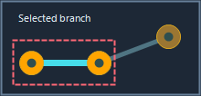

# KiCad KRT Gloss

**Transformez un routage déjà terminé en un cuivre plus direct, plus simple et
mieux centré, sans le redessiner.** KiCad KRT Gloss est un plugin pour
l’Éditeur de circuit imprimé de KiCad : il améliore les pistes existantes en
respectant les contraintes de votre carte.


Gloss ne remplace pas le routeur interactif et ne crée pas une carte à partir
de rien. Il travaille uniquement sur le cuivre déjà routé. KRT reste chargé de
vérifier les obstacles, les clearances et la connectivité avant qu’une
modification ne soit acceptée.

## Installer et ouvrir le plugin

Installez l’archive ZIP du plugin dans KiCad : ouvrez le **Plugin and Content
Manager**, choisissez **Install from File…**, sélectionnez l’archive, puis
redémarrez KiCad si le plugin n’apparaît pas encore. Cette procédure est la
même que celle employée par les plugins KiCad distribués au format PCM.

Dans l’**Éditeur de circuit imprimé**, ouvrez ensuite
**Tools → External Plugins → KiCad KRT Gloss**. Vous pouvez aussi lancer le
plugin depuis son icône de barre d’outils lorsque KiCad l’affiche.


Deux raccourcis utiles :

- Avec des pistes d’un seul net sélectionnées, Gloss peut être lancé
  directement avec les derniers réglages mémorisés.
- Avec aucune piste, plusieurs nets, ou pour choisir précisément les réglages,
  la fenêtre ci-dessus s’ouvre. Aucun net n’est coché par défaut si rien n’est
  sélectionné : c’est volontaire, afin de ne jamais modifier toute la carte
  par surprise.

## Choisir ce que le plugin peut modifier

La liste de gauche est le point de départ le plus important. Cochez les nets
que vous souhaitez traiter ; le nombre apparaît dans **Selected Nets**. Cliquer
sur une ligne permet de la repérer dans KiCad, tandis qu’une coche l’ajoute à
l’action Gloss ou Centering.



Voici à quoi servent les commandes de l’onglet **General** :

| Réglage ou commande | Utilisation |
| --- | --- |
| **Filter** | Retrouve rapidement un net par son nom. |
| **Comp Filter** / **Component** | Restreint la liste aux nets d’un composant, par exemple `U1`. |
| **Separate by net class** | Range la liste par classes de nets lorsque la carte en utilise. |
| **Select / Unselect** | Coche ou décoche les lignes actuellement mises en surbrillance. |
| **Add** | Ajoute les nets des pistes actuellement sélectionnées dans KiCad aux coches existantes. |
| **Replace** | Remplace les coches par les nets des pistes actuellement sélectionnées dans KiCad. |
| **Clear** | Décoche tout, sans modifier votre sélection d’objets dans KiCad. |
| **Use elementary branches** | Limite le travail à la branche complète portant la piste sélectionnée : elle s’arrête à un pad, une extrémité libre ou une jonction. Décochez cette case pour traiter les nets complets. |
| **KRT grid step** | Définit la finesse de recherche. Une valeur plus petite peut trouver des gains plus fins, mais demande davantage de temps. |
| **Time budget** | Limite le temps de la passe initiale. La préparation, la validation finale et les répétitions éventuelles peuvent prolonger le temps total. |

Une branche mémorisée reste liée à la géométrie qui a été importée. Après un
remplacement de pistes, utilisez à nouveau **Add** ou **Replace** pour la
réimporter. Lorsqu’un net est entièrement couvert par les branches importées,
il est simplement traité comme un net complet.

## Régler et lancer Gloss

Sélectionnez l’onglet **Gloss**, vérifiez les options, puis cliquez sur le
bouton **Gloss** en bas de la fenêtre. Le bouton reste indisponible tant
qu’aucun net n’est coché.


| Option | Effet |
| --- | --- |
| **Stay in corridor** | Impose que chaque mouvement reste atteignable par une déformation continue et sûre depuis le tracé initial. Activez-la lorsque la piste ne doit pas franchir un obstacle, même si une position finale de l’autre côté semblerait libre. |
| **Movable vias** | Autorise le déplacement d’un via déverrouillé lorsque ses deux raccords peuvent être raccourcis sans changer ses caractéristiques ni enfreindre les contrôles. |
| **G4 — Repeat Gloss until stable** | Recommence des passes de Gloss jusqu’à ce qu’il n’y ait plus d’amélioration utile, dans la limite choisie. À réserver aux cas où vous voulez explorer davantage : une passe complète peut prendre du temps. |
| **G4 passes** | Fixe le nombre maximal de répétitions G4. |


Gloss privilégie d’abord une réduction de longueur ; à longueur égale, il
privilégie moins de segments. Il conserve la largeur, les couches, les
connexions et les zones protégées. S’il ne trouve pas d’amélioration sûre, il
laisse la piste telle quelle : c’est un résultat normal.

## Recentrer une piste dans un passage

Le **Centering** a un but différent de Gloss : il place une piste au mieux
entre deux obstacles proches, par exemple entre deux pads ou deux zones de
cuivre. Il peut donc conserver, voire augmenter légèrement, la longueur pour
obtenir des marges plus équilibrées.


Dans cet onglet :

- **Proximity max** indique la distance maximale, de centre à centre, entre
  deux obstacles susceptibles de former un passage. La valeur peut aller de
  0 à 5 mm ; 1 mm est la valeur initiale.
- **Refresh** reprend cette distance à partir de deux pads exactement
  sélectionnés dans KiCad, lorsque leur entraxe est compris entre 0 et 5 mm.
- La ligne d’état sous l’illustration explique le résultat de cette opération
  ou rappelle ce qui manque.


Cliquez sur **Centering** dans la barre inférieure pour l’exécuter. L’action
est atomique : elle lance d’abord Gloss en restant obligatoirement dans le
corridor, recentre ensuite la piste, puis ne transforme plus la géométrie.
Si l’ensemble ne peut pas être validé, le cuivre de départ est conservé.

## Comprendre le résultat

Après une action, le dialogue reste ouvert : vous pouvez ajuster un réglage et
relancer sur la même sélection. L’onglet **Log** conserve les étapes, les
gains et le résultat final ; **Copy Log** le copie, et **Clear Log** remet cet
historique à zéro. L’onglet **About** rappelle les versions et crédits du
plugin.


Sur la carte, le plugin utilise une couche utilisateur libre nommée
**TrackGloss Changes** (ou la première couche `User.N` disponible) pour
visualiser la différence : ancien cuivre en pointillé, nouveau cuivre en trait
plein, et positions avant/après des vias déplacés. Cette couche est seulement
une aide de lecture ; elle n’est pas incluse dans les Gerbers sauf si vous
l’ajoutez volontairement à votre travail de tracé. Une couche déjà utilisée par
votre projet n’est jamais écrasée.

Avant de fabriquer la carte, conservez votre contrôle habituel : inspection
visuelle, DRC KiCad et revue des modifications. La validation du plugin est un
contrôle géométrique et électrique de son résultat ; elle ne remplace pas tous
les contrôles de conception et de fabrication de KiCad.

## Utiliser Gloss en ligne de commande

La ligne de commande convient à un traitement reproductible de fichiers PCB.
Elle exécute **Gloss** sur des nets complets ; le choix de branches et
Centering restent volontairement réservés à la fenêtre KiCad.


```text
python gloss.py input.kicad_pcb output.kicad_pcb --nets "/Cpu/*"
python gloss.py input.kicad_pcb --component U1 --preview
python gloss.py input.kicad_pcb --nets "/A" --stay-in-corridor --preview
python gloss.py input.kicad_pcb --json-out gloss-summary.json
python gloss.py input.kicad_pcb --debug-layer auto
```

Sans sélection de nets, la CLI traite tous les nets routés — à la différence
de la fenêtre KiCad, qui attend une sélection explicite. `--preview` ne
réécrit pas le PCB ; il peut néanmoins produire le rapport JSON demandé avec
`--json-out`. `--stay-in-corridor` active la même protection de corridor que
l’option du dialogue. `--debug-layer auto` ajoute une superposition
avant/après sur une couche utilisateur libre.

La sortie indique notamment le gain de longueur, les nets modifiés, les
changements de segments et de vias, le statut de validation et le temps passé.

## Limites à connaître


- Gloss et Centering traitent un routage existant ; ils ne sont pas un
  autorouteur.
- Les pistes avec contraintes de longueur ou de temps, paires différentielles,
  contraintes d’impédance, cuivre verrouillé ou arcs sont protégées et ne
  deviennent pas modifiables par une simple sélection.
- Centering recherche des passages définis par deux obstacles ; un obstacle
  isolé n’entraîne pas de recentrage.
- Un résultat sans changement peut indiquer que le tracé est déjà le meilleur
  résultat sûr dans la portée choisie.

## Auteurs et licence


L’adaptation autonome est développée par **ChatGPT/Codex (OpenAI)** avec
**Frantz**, co-auteur, propriétaire et mainteneur du projet. **DrAndyHaas**
est l’auteur principal de
[KiCad Routing Tools (KRT)](https://github.com/drandyhaas/KiCadRoutingTools),
sur lequel ce projet s’appuie.

KiCad KRT Gloss est distribué sous [licence MIT](LICENSE). Les crédits détaillés
et avis conservés figurent dans [AUTHORS.md](docs/AUTHORS.md) et
[NOTICE](NOTICE).
