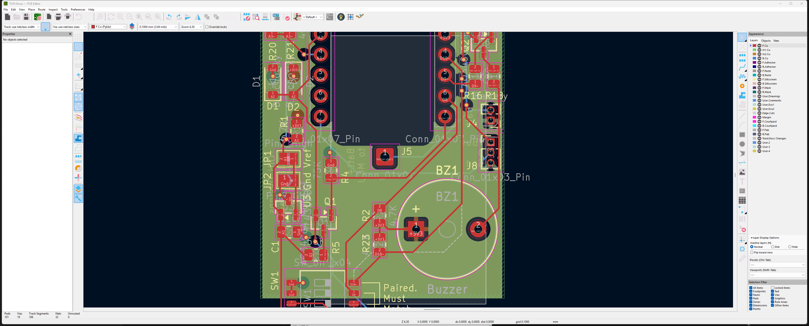
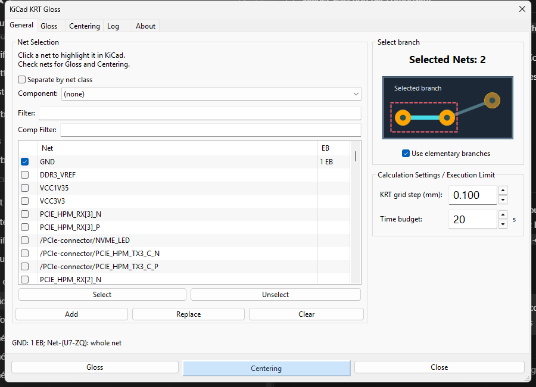
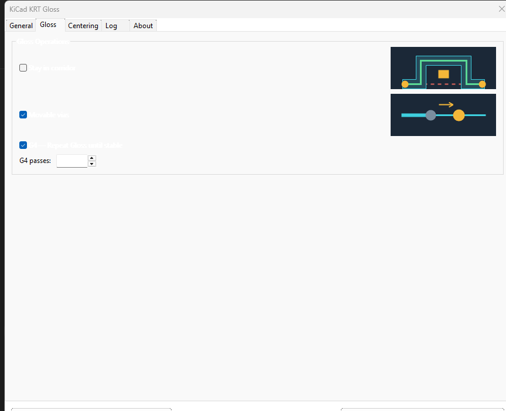
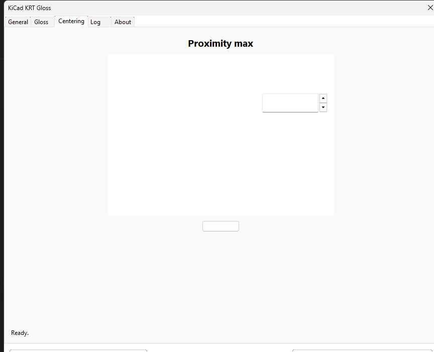
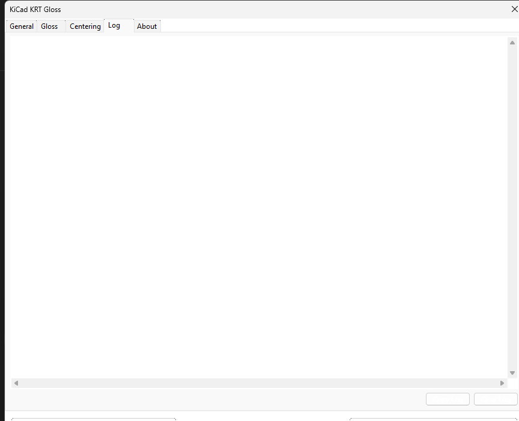
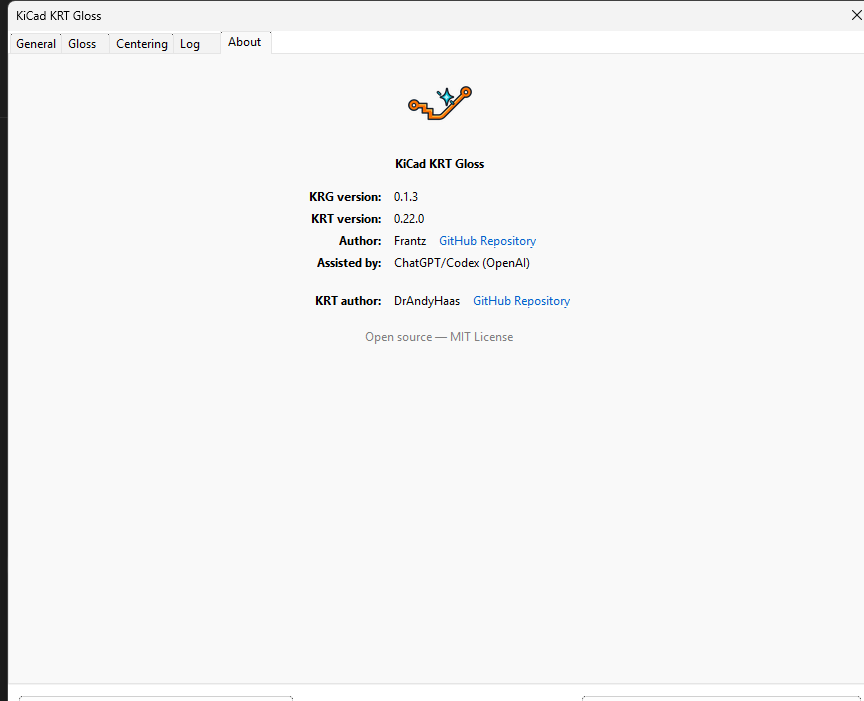

# KiCad KRGloss

KiCad KRGloss reduces and simplifies one or more already routed tracks, most
often after autorouting or manual routing. It is built on KiCad Routing Tools
by Dr DrAndyHaas, which provides obstacle, clearance and connectivity checks.

This KiCad capture uses a medium board and runs Gloss only on the small
`D10~` track set. In the **Appearance** panel, the active copper layers and
**TrackGloss Changes** on `User.1` are visible together: the solid red routing
is the result, while the dotted overlay preserves the former path for review.

## Install

In KiCad, open **Plugin and Content Manager**, choose **Install from File…**,
select the plugin ZIP, then open **PCB Editor → Tools → External Plugins →
KiCad KRGloss**.

## Choose the scope

1. Check the nets to process.
2. Click a row to highlight its remembered scope in KiCad.
3. Use **Add** or **Replace** to import the current KiCad selection; **Clear**
   empties the list.

With **Use elementary branches** enabled, a selected track imports its complete
branch up to pads, free ends or junctions. A row showing `n EB` contains
remembered branches; an empty EB cell means the whole net. Disable the option
to always process complete nets.

If nothing is selected in KiCad, the dialog opens with no checked net. The
action buttons remain disabled until at least one net is checked.

## Gloss

- **Stay in corridor** prevents a movement from crossing or jumping over an
  obstacle.
- **Movable vias** allows eligible unlocked vias to move.
- **Repeat Gloss until stable** requests additional passes, up to the displayed
  G4 limit.

Click **Gloss**. A valid route may remain unchanged when no safe improvement
exists.

## Centering and Proximity max

To set **Proximity max** from the board:

1. In KiCad, select **exactly two pads**.
2. Open the **Centering** tab.
3. Click **Refresh**.
4. Check the centre-to-centre distance displayed in **Proximity max**.
5. Check the target net and click **Centering**.

The two-pad selection is used only to measure Proximity max. The checked net
or remembered elementary branches define which track is processed.

Proximity max is the largest pad centre-to-centre spacing accepted when
detecting a gate. Centering first runs a corridor-constrained Gloss, then moves
the track towards the middle of valid gates. No geometry transformation runs
after Centering.

## Review the result

### Log tab

The **Log** tab records the options, net names and result. The plugin also
creates or reuses **TrackGloss Changes** on a free User layer: old copper is
dashed and new copper is solid. This layer is a visual aid, not a replacement
for KiCad's visual inspection and DRC.

### About tab

Gloss and Centering modify existing routing only. Locked or protected copper,
arcs, differential pairs and constrained tracks remain protected.

## Author and licence

**Frantz** is the author, project owner and maintainer. The project was
developed with assistance from **ChatGPT/Codex (OpenAI)**.

**DrAndyHaas** is the author and primary code provenance of
[KiCad Routing Tools (KRT)](https://github.com/drandyhaas/KiCadRoutingTools).
KiCad KRGloss is distributed under the [MIT License](LICENSE); detailed
provenance is recorded in [AUTHORS.md](docs/AUTHORS.md) and [NOTICE](NOTICE).
