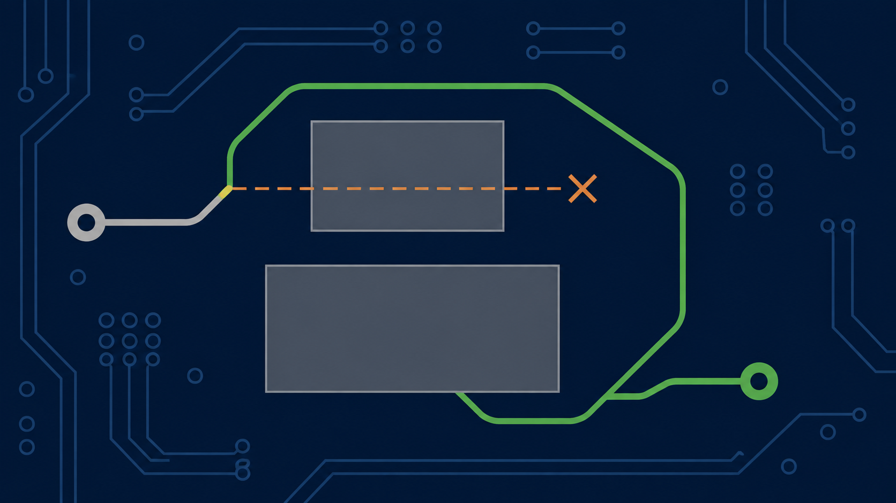
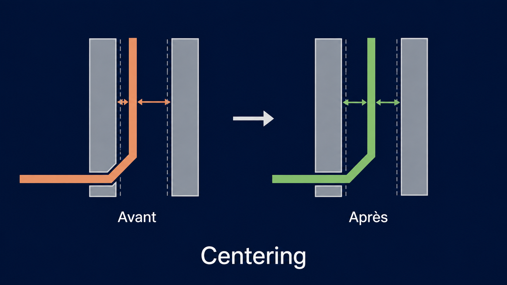
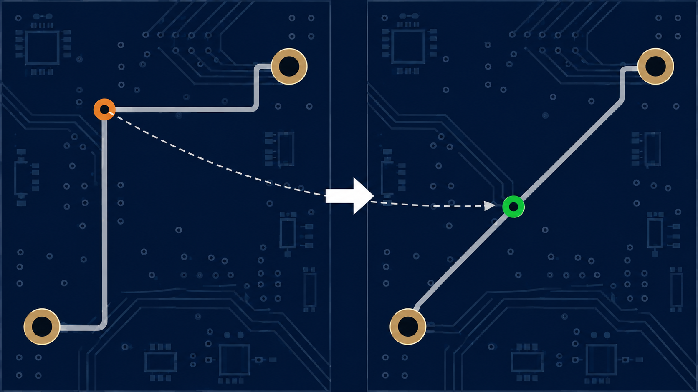

# Track Gloss — reference specification

This document defines the functional rules and invariants. For an accessible
explanation of the two actions, see [`gloss_explain.md`](gloss_explain.md).

## Purpose

Track Gloss is a final treatment of an existing route. It improves route
geometry without autorouting and without changing the design beyond this final
treatment.

The mandatory order of objectives is:

1. respect the input data and every applicable rule;
2. during length-reduction phases, reduce length with a gain strictly greater
   than the useful grid step;
3. at equal length, reduce the segment count;
4. keep an exclusively octilinear output: 0, 45, or 90 degrees;
5. create no micro-segment, jog, or unnecessary detour.

Length reduction may increase the segment count: the secondary objective must
not block the primary one. An unreachable shorter destination in the corridor
does not prove that an intermediate reduction is impossible. Joints must be
examined as well as individual segment directions. Via, pad or junction changes
may expose another local reduction; affected nets are revisited before final
certification, independently of whether G4 is enabled.

## Definition

- A seed is a KRT segment explicitly designated as the starting point of a
  transformation.
- An elementary branch is the maximal unbranched path containing its seed. It
  ends at a pad, free end, or T/X junction. It continues through a width or
  layer change and through a via that is not itself a branch point.
- **MO3 — Fixed and protected elements.** A fixed, locked, or protected element
  keeps its position, geometry, and attributes. It may serve as an anchor or
  obstacle, but no gloss stage may move, replace, or modify it. Mobility is
  allowed only when a rule explicitly provides for it and all its conditions
  are met.

### Admissible corridor

An admissible corridor is the set of positions an electrical element can reach
from its initial geometry through a continuous deformation that respects
clearances, copper thickness, connectivity, fixed anchors, and the modifiable
scope at every instant.

**The element must neither cross an obstacle nor jump over it from one side to
the other**, even when both the initial and final geometries are valid. This
prohibition applies throughout the movement: a track, movable via, or movable
junction must respect it together with its incident segments.

Going around an obstacle is admissible only if an entirely permitted continuous
deformation exists. Checking the destination alone therefore does not establish
corridor compliance. The corridor is neither a fixed-width band around the track
nor a region defined by the grid: its boundaries follow from obstacles and
applicable constraints, for which KRT remains authoritative.

When a certificate tests only one particular deformation, failure means that
this deformation is not certified; it does not prove that no other admissible
deformation exists.

## Exclusion

Before any transformation, the following nets are excluded in full from the
modifiable scope:

1. length- or timing-constrained groups;
2. coupled differential pairs;
3. impedance-constrained nets;
4. nets containing locked copper, whether track or via;
5. nets containing arcs.

These exclusions remain obstacles for other nets. Explicit selection does not
override their protection.

## Sequencing

Gloss and Centering are distinct actions with different objectives. Gloss
reduces and simplifies; Centering places a track as well as possible in a
passage. Centering may preserve or slightly increase length, so it is not
subject to the minimum-gain condition used by length-reduction phases.

When Centering is requested, the sequence is mandatory and atomic:

1. run Gloss with `stay_in_corridor=True`;
2. run Centering on that result;
3. apply no further geometry transformation after Centering.

Centering is therefore the final geometry transformation of the action. On
failure, budget expiration, or non-compliance, the input is restored according
to the transaction policy.

## Scope

- The gloss processes one or more explicitly designated elementary branches.
- Outside the scope, the remainder of the net is preserved and participates in
  the same topology and obstacle checks as copper from other nets.
- A connection is considered from fixed pad to fixed pad and remains continuous
  through its vias.
- Only copper belonging to the connection under examination may be changed;
  every other copper item remains an obstacle.
- A width change alone does not terminate or split a connection.
- A track receives no implicit protection from its apparent purpose.

## Fixed points and topology

### Pads

The native pad landing point, usually its center, is fixed. A track may not
arbitrarily choose another point on the pad edge. The final pad connection
remains octilinear.

### Vias

A fixed via is an articulation crossed by the connection, not a termination. A
via may be mobile only when all four conditions below hold:

1. exactly two segments of the same net are incident to it;
2. those segments belong to two different copper layers;
3. both sides belong entirely to the modifiable scope;
4. no native constraint fixes its position.

When a via is mobile, its diameter, drill, type, net, and layer span remain
unchanged. Its initial position remains a valid fallback solution.

### T junctions and nodes

In a T made of two collinear segments forming a rail and one branch, the branch
connection may move along the rail without moving the rail itself. The branch
may be perpendicular to the rail: this 90-degree angle is allowed and may be
the minimum-length solution. It must not be confused with a parasitic
90-degree bend at the other end of the branch.

An optional variant may handle a T without a collinear pair: each of the three
segments is considered in turn as the branch, with the other two as possible
rails. After the move, any parasitic 90-degree bend left at the old node is
simplified according to the general gloss rules. When this variant is disabled,
a node without a collinear pair remains fixed. Fixed pads and vias take
precedence over junction mobility.
