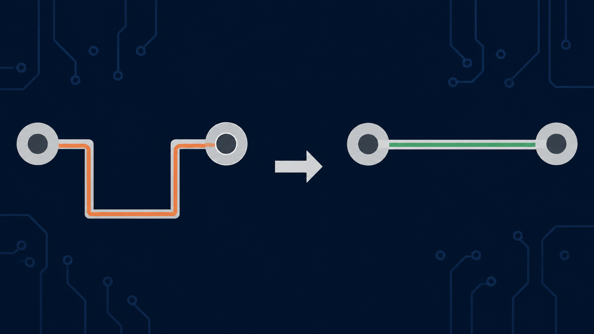
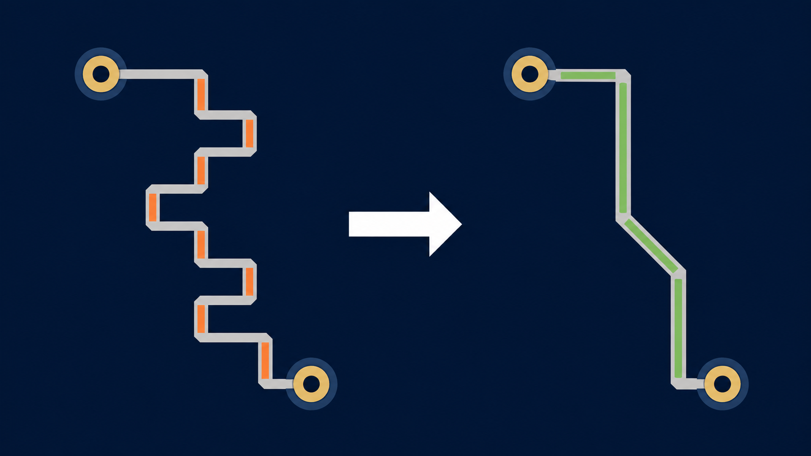
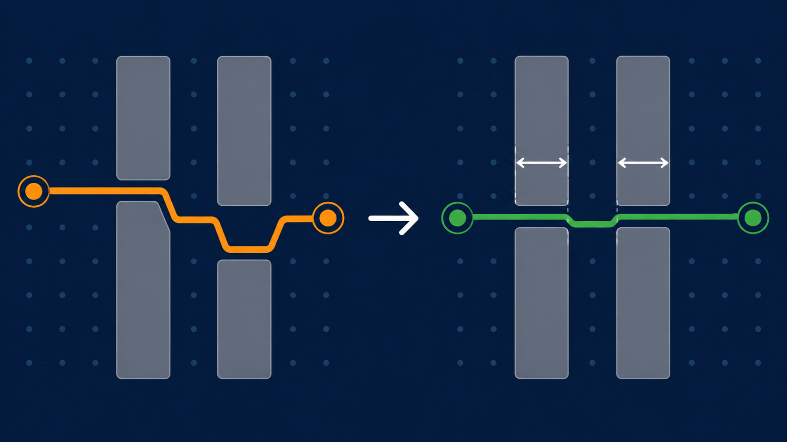

# Gloss et Centering

## 1. Deux actions pour deux objectifs

Une piste routée est une suite de segments reliant des points fixes, tels que
des pads, des vias immobiles ou des jonctions. Elle doit rester connectée et
respecter les distances minimales au cuivre voisin.

Le **Gloss** et le **Centering** améliorent cette géométrie, mais leur but est
différent :

| Action | But | Effet possible sur la longueur |
|---|---|---|
| Gloss | Raccourcir et simplifier le chemin | La réduit, ou la conserve en supprimant un détour inutile |
| Centering | Placer la piste au mieux dans un passage | Peut la conserver ou l'augmenter légèrement |

Ils ne redessinent pas librement une connexion. Ils travaillent sur le cuivre
déjà routé, seulement là où une modification est autorisée.

## 2. Règles communes

Les éléments fixes et les zones protégées sont d'abord identifiés. Ils servent
d'ancres ou d'obstacles et ne sont jamais déplacés. Chaque modification doit
préserver les propriétés suivantes :

- la connexion électrique reste continue ;
- les largeurs, les couches et les attributs imposés restent inchangés ;
- les distances requises aux autres éléments sont respectées ;
- aucune piste ne traverse un obstacle ;
- aucun segment minuscule, décrochement gratuit ou détour inutile n'est créé ;
- la géométrie conserve les directions autorisées par le routage de la carte.

La portion modifiée est limitée à une portée autorisée. Le reste du net ne
bouge pas et reste pris en compte comme obstacle lorsque c'est nécessaire.

### Le corridor admissible

Le corridor admissible est l'ensemble des positions qu'un élément peut atteindre
depuis sa position initiale par un mouvement continu et sûr. Le départ et
l'arrivée ne suffisent donc pas : tout le déplacement entre les deux doit aussi
être valide.

Une piste ne peut pas, par exemple, passer de l'autre côté d'un obstacle parce
que sa seule position finale serait libre. La même règle s'applique aux vias et
aux jonctions lorsqu'ils sont mobiles.

#### Illustration — Mouvement continu autour des obstacles

## 3. Le Gloss

### 3.1 Son but

Le Gloss rend un routage existant plus direct. Il cherche d'abord les portions
qui peuvent être raccourcies, puis les formes de même longueur utilisant moins
de segments. S'il n'existe aucune amélioration sûre, la piste est conservée.

### 3.2 Le principe géométrique

Le Gloss raisonne sur les relations entre segments voisins, jamais sur leur nom
ni leur orientation à l'écran. Un segment intérieur peut être déplacé
parallèlement à lui-même. Ses extrémités sont alors recalculées pour rejoindre
les segments qui l'encadrent.

Le même raisonnement vaut quelle que soit l'orientation des segments. Tourner
ou refléter la même forme ne doit pas lui donner un traitement différent. Les
limites du mouvement viennent des ancres, des segments voisins, des obstacles
et des règles communes.

### 3.3 Choisir une amélioration

Pour chaque mouvement possible, le Gloss reconstruit la portion concernée et
vérifie qu'elle est réalisable. Parmi les candidats valides, il privilégie :

1. une réduction de longueur utile ;
2. à longueur équivalente, une réduction du nombre de segments ;
3. à résultat équivalent, la géométrie la plus simple.

Un gain trop petit pour être distingué de la résolution de la grille n'est pas
retenu. Cela évite les changements invisibles, instables ou créant de très
petits segments.

#### Illustration — Même connexion, moins de segments

### 3.4 Ce que le Gloss peut améliorer

Le Gloss peut notamment enlever un détour entre des segments voisins, fusionner
des segments alignés, raccourcir une arrivée de piste ou déplacer localement un
via ou une jonction lorsque leur mobilité est explicitement autorisée. Chaque
amélioration reste locale : elle ne donne pas le droit de déplacer un élément
fixe, de modifier une zone protégée ou de changer la fonction électrique d'une
connexion.

#### Illustration — Déplacer un via pour raccourcir ses deux jambes

## 4. Le Centering

### 4.1 Son but

Le Centering recherche les **portes** : des passages formés par deux obstacles
qui encadrent une piste. Il place la piste aussi équitablement que possible dans
ces passages, avec des marges cohérentes de chaque côté.

Un obstacle isolé ne définit pas une porte et ne déclenche donc pas, à lui seul,
un recentrage.

### 4.2 Trouver l'axe d'un passage

Pour chaque porte, le Centering mesure l'espace réellement disponible de part
et d'autre de la piste. L'axe recherché n'est pas toujours le milieu visible :
il tient compte des distances qui doivent rester libres.

Si l'axe exact ne peut pas être atteint sans enfreindre une règle, le meilleur
recentrage réalisable est choisi. S'il n'existe aucun mouvement sûr, la piste
reste à sa place.

### 4.3 Plusieurs portes successives

Une même branche peut traverser plusieurs portes. Le Centering peut alors
décomposer la piste en plusieurs segments afin de passer proprement par leurs
axes, tout en raccordant les portions avant et après chaque passage.

Cette construction est guidée par le passage entre obstacles, et non par la
longueur minimale. Le résultat peut donc être un peu plus long que celui du
Gloss seul.

#### Illustration — Centrage à travers plusieurs portes

## 5. Enchaînement des actions

Le Centering ne constitue pas une étape de Gloss. Lorsque les deux actions sont
demandées, l'ordre est toujours le suivant :

1. le Gloss améliore la piste en restant dans son corridor admissible ;
2. le Centering place ensuite la piste dans les portes détectées ;
3. aucune autre transformation géométrique n'est appliquée après le Centering.

Une réduction exécutée après un recentrage pourrait défaire la position choisie
dans un passage. Le résultat livré est donc la géométrie centrée et validée.

## 6. Résultat attendu

Le résultat peut être une piste plus courte, une piste plus simple, une piste
mieux centrée dans un passage, ou la piste initiale si aucune amélioration ne
respecte toutes les règles. L'absence de modification est normale : elle
signifie que la géométrie existante est déjà la meilleure solution sûre dans la
portée examinée.
