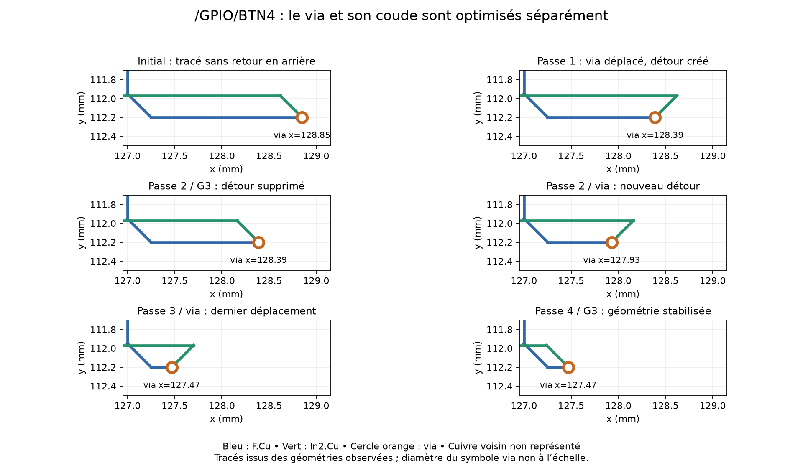

# Pourquoi /GPIO/BTN4 demande quatre passages modifiants

Analyse du net 59 de tildagon_base (PACK0), 23 segments initiaux et deux vias.
La mesure d'auto-convergence avait trouvé quatre passages modifiants et un
cinquième sans changement. Une seule relecture instrumentée du net reconstitue
les géométries à chaque étape et les motifs de rejet de G3.1/G3.4. Il ne s'agit
pas d'une répétition de mesure de performance. Aucun algorithme modifié.

## Cause observée : le coude et le via sont optimisés séparément

G3 raccourcit les pistes en gardant les vias fixes. G3.1 déplace un via en
gardant fixes les autres extrémités de ses deux segments incidents. L'une de
ces extrémités est ici un coude mobile, mais G3.1 la traite comme un ancrage.
Ces deux sous-problèmes sont donc résolus alternativement, et non ensemble.

Dans la zone montrée, le segment F.Cu est à y=112,20 mm et le segment In2.Cu
à y=111,97 mm, soit un décalage de 0,23 mm. Leur liaison diagonale à 45 degrés
a une projection horizontale de 0,23 mm. Les deux orientations possibles autour
du coude placent le via de part et d'autre à une distance horizontale totale de
0,46 mm. Ce pas observé vient donc de la géométrie, pas de la grille de 0,1 mm.

Au départ : via (128,85 ; 112,20), coude In2.Cu (128,62 ; 111,97).
G3.1 passe le via à (128,39 ; 112,20), en gardant le coude à 128,62.
La jambe diagonale conserve sa longueur et la piste F.Cu raccourcit de 0,46 mm,
mais le trajet In2.Cu présente maintenant un retour en arrière.

À la passe suivante, G3 déplace le coude de 128,62 à 128,16 en gardant le via
à 128,39. Il supprime ce détour et gagne encore 0,46 mm. G3.1 peut alors placer
le via à 127,93 et recréer la même situation. Aucun voisin ne s'est déplacé.

| Passe | Gain G3 pistes | Gain G3.1 via | Autre gain | Via final x | Coude final x |
|---|---:|---:|---:|---:|---:|
| Initial | — | — | — | 128,85 | 128,62 |
| 1 | 0 | 0,46 mm | 0,0000714 mm | 128,39 | 128,62 |
| 2 | 0,46 mm | 0,46 mm | 0 | 127,93 | 128,16 |
| 3 | 0,46 mm | 0,46 mm | 0 | 127,47 | 127,70 |
| 4 | 0,46 mm | 0 | 0 | 127,47 | 127,24 |
| 5 | 0 | 0 | 0 | 127,47 | 127,24 |

Le petit gain G3 local de la première passe correspond à des réécritures de
coordonnées ailleurs sur le net, visibles dans la trace. Il ne porte pas les
2,76 mm de réduction de la zone du via et n'explique pas cette cascade.

## Pourquoi les autres étapes ne terminent pas le travail immédiatement

La première G3 est déjà passée quand G3.1 modifie le via. La réduction locale
en fin de chaîne n'a pas supprimé ce détour dans cet essai. Elle utilise une
famille de candidats distincte et impose un certificat de corridor, même dans
cette fin de chaîne du mode global corridor=False. Le rejet individuel de ce
remplacement local n'est pas attribué par cette trace : il ne faut pas conclure
qu'il est impossible ni affirmer que le corridor est la cause sans le tracer.

G3.4 suit les chaînes complètes et tente des connexions droites jusqu'aux
ancrages éloignés. Pour le via concerné, après le premier déplacement, ces
ancrages sont (127,00 ; 111,95) et l'autre via (110,639729 ; 110,389729).
Les candidats qui diminuent assez la longueur sont refusés par la règle d'angle
droit à la frontière ou le filtre de grille KRT. G3.4 ne génère donc pas ici
le candidat intermédiaire « même tracé lointain, via et seul coude voisin mobiles ».
Un refus grille ne prouve pas à lui seul une collision géométrique exacte.

G3.1 observe un voisinage trop court pour coordonner le coude ; G3.4 remplace
un voisinage beaucoup plus long par des jambes droites. Il manque une famille
intermédiaire de candidats dans cet exemple.

## Pourquoi la séquence s'arrête ensuite

Après la quatrième passe, les nouvelles positions G3.1 raccourcissant les deux
jambes sont rejetées : certaines créent des segments de 0,01 à environ 0,014 mm,
sous le seuil de 0,1 mm ; la position (127,13 ; 112,08), gain théorique 0,22 mm,
échoue à `via_clears` ; (127,36 ; 112,09), même gain théorique, crée un angle
droit interdit à la frontière. Il ne suffit donc pas de poursuivre le même
mouvement indéfiniment.

Ces observations expliquent le point fixe des candidats actuels, pas un optimum
global. Elles ne justifient pas de relâcher les règles de clearance, les contrôles
de via ou la suppression des microsegments.

## Correctifs à envisager, non implémentés

1. Après un déplacement de via, normaliser immédiatement les petites fenêtres
   de piste incidentes affectées, puis réexaminer ce via. Une fermeture locale
   de ce type évite de refaire les autres nets et toutes les autres étapes pour
   enlever un détour créé par la transformation précédente.
2. Plus directement, générer des candidats où le via et le premier coude de
   chaque côté peuvent bouger ensemble. Les véritables ancrages extérieurs
   restent fixes ; les coudes intermédiaires sont des variables. Les relations
   octolinéaires permettent une génération géométrique ciblée, sans balayage
   de tous les points de grille.
3. Classer ces candidats sur la longueur de toute la petite fenêtre réécrite,
   puis appliquer les validations KRT, la connectivité et, si demandé, le
   certificat de mouvement en corridor pour l'ensemble des segments et du via.

La première piste est une amélioration d'enchaînement local ; la seconde élargit
le sous-problème géométrique pour éviter les petits déplacements successifs.
Aucune accélération ni possibilité d'obtenir directement le résultat final
avec un nouveau candidat n'est mesurée ici. Ce serait l'objet du prototype
correctif, avec comparaison de géométrie, nombre de validations et temps.

## Éléments vérifiables

- G3.1 : `dgloss/via_mobile.py`, `move_mobile_vias`, choix des deux ancrages
  incidents et `_candidate_positions`.
- G3/G3 local : `dgloss/algorithm.py`, `shorten_routes` ;
  `dgloss/local_gloss.py`, `local_replacement`.
- Enchaînement : `dgloss/pipeline.py`, `_run_optimization_pass`.
- Reproduction : `python tools/trace_btn4_passes.py`.
- Trace : `data/trace_btn4_passes_2026_09_07.json` (états par étape, lignes de
  refus et sélections). Les champs de variables d'un événement hors évaluation
  d'un candidat peuvent encore refléter le candidat précédent ; interpréter
  uniquement les événements de test correspondants à la ligne exécutée.

La trace retrouve les cinq appels attendus. G5 final certifie 14 segments et un
via, et le SHA256 de la source reste inchangé. Le cuivre voisin n'est pas
représenté sur le schéma. Aucun DRC natif exécuté ; aucun correctif de production,
aucune modification de KRT et aucun PCB de sortie.
