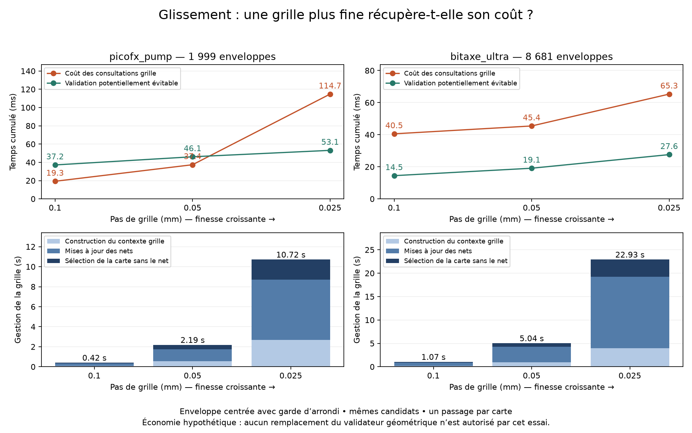

# Glissement : coût et rendement des grilles fines

Essai demandé le 7 septembre 2026 : comparer les pas 0,1 / 0,05 / 0,025 mm
avant d'envisager une grille à résolution variable. Aucun changement de KRT
ou du moteur de production. Le harnais est expérimental.

## Protocole

Un seul Gloss instrumenté par carte connue, sans répétition ni préchauffage.
Les trois grilles observent simultanément les mêmes enveloppes centrales du
prototype adaptatif, avec les mêmes révisions du cuivre. Leurs réponses ne
modifient jamais les candidats ni leur acceptation. Les caches de consultations
sont séparés par pas et par variante, et limités à une recherche.

Deux variantes : enveloppe centrée seule, et centrée avec garde d'arrondi
de largeur `sqrt(2) * pas`. Cette garde n'est pas une preuve générale de parité.
Les clearances et réserves KRT restent inchangées ; seules les grilles et les
marges calculées par KRT changent avec le pas. Pas de constante de 0,3 mm ajoutée.

Le contexte de chaque grille est construit une fois à la première enveloppe
observée, puis mis à jour avec les mêmes appels `refresh_net_obstacles` que le
contexte principal. Les cartes excluant le net courant sont réutilisées via
`foreign_obstacles`. Les coûts de construction, mise à jour et sélection sont
mesurés séparément. La construction inclut le contexte dgloss, pas seulement
l'allocation native. Les grilles observatrices sont supplémentaires à celle
du Gloss ; le temps mural de cette exécution instrumentée n'est donc pas une
mesure du temps d'un Gloss utilisant une seule résolution.

Le budget est porté à 1 200 s pour absorber l'instrumentation ; les deux cartes
convergent. Aucun Centering, DRC natif KiCad ou remplissage de zones n'est lancé.
Les sources PCB ne sont pas écrites et leurs SHA256 sont vérifiés.

## Croisement des coûts, avec garde d'arrondi



La validation potentiellement évitable est la somme des temps géométriques
mesurés sur les requêtes où grille et validateur répondent tous deux « libre ».
Ce n'est pas une économie réalisée : toutes les validations restent exécutées.
La différence ne devient exploitable qu'après justification du certificat grille.

| Carte | Pas mm | Consultations, cache et préparation inclus | Validation potentiellement évitable | Solde hypothétique hors gestion grille | Réponses libres |
|---|---:|---:|---:|---:|---:|
| picofx_pump | 0,1 | 19,26 ms | 37,15 ms | +17,89 ms | 135 / 1 999 |
| picofx_pump | 0,05 | 37,39 ms | 46,09 ms | +8,71 ms | 178 / 1 999 |
| picofx_pump | 0,025 | 114,72 ms | 53,12 ms | -61,60 ms | 206 / 1 999 |
| bitaxe_ultra | 0,1 | 40,55 ms | 14,47 ms | -26,08 ms | 59 / 8 681 |
| bitaxe_ultra | 0,05 | 45,44 ms | 19,10 ms | -26,34 ms | 80 / 8 681 |
| bitaxe_ultra | 0,025 | 65,31 ms | 27,58 ms | -37,73 ms | 109 / 8 681 |

Sur picofx, le solde change de signe entre 0,05 et 0,025 mm ; on ne peut pas
interpoler un seuil précis avec trois points et des marges discontinues.
Sur bitaxe, aucun pas testé n'est rentable avec garde, même sans gestion grille.

Temps des seuls appels non servis par le cache (wrapper `_segment_fits_wide`
inclus ; ce n'est pas un profil interne Rust), variante avec garde :

| Carte | Pas mm | Appels | Temps appels | Moyenne par appel | Réutilisations |
|---|---:|---:|---:|---:|---:|
| picofx | 0,1 | 1 114 | 7,46 ms | 6,70 µs | 885 |
| picofx | 0,05 | 1 332 | 26,06 ms | 19,57 µs | 667 |
| picofx | 0,025 | 1 539 | 102,66 ms | 66,71 µs | 460 |
| bitaxe | 0,1 | 1 178 | 2,72 ms | 2,31 µs | 7 503 |
| bitaxe | 0,05 | 1 380 | 8,02 ms | 5,81 µs | 7 301 |
| bitaxe | 0,025 | 1 605 | 26,44 ms | 16,47 µs | 7 076 |

Affiner coûte à la fois plus cher par appel et davantage d'appels, car moins
de requêtes partagent la même clé discrétisée. Les appels quittent dès le
premier obstacle rencontré : les résultats ne suivent pas une loi quadratique
exacte. Les requêtes diagonales parcourent un rectangle englobant, pas seulement
une ligne de cellules. La préparation de la garde par `dataclasses.replace`
est comptée dans les consultations ; elle participe au coût Python observé.

## Gestion des grilles

| Carte | Pas mm | Construction | Mises à jour | Sélection sans net | Total |
|---|---:|---:|---:|---:|---:|
| picofx | 0,1 | 0,101 s | 0,221 s | 0,095 s | 0,417 s |
| picofx | 0,05 | 0,542 s | 1,216 s | 0,435 s | 2,193 s |
| picofx | 0,025 | 2,687 s | 6,020 s | 2,013 s | 10,720 s |
| bitaxe | 0,1 | 0,190 s | 0,716 s | 0,160 s | 1,066 s |
| bitaxe | 0,05 | 0,962 s | 3,319 s | 0,763 s | 5,044 s |
| bitaxe | 0,025 | 3,957 s | 15,306 s | 3,667 s | 22,929 s |

Une construction et 47 mises à jour sur picofx, une construction et 84 mises
à jour sur bitaxe. Les sélections incluent le premier clone et les changements
du net exclu. Le maintien suit tous les rafraîchissements du moteur ; une
politique différée ou limitée à une zone n'est pas testée.

La grille 0,1 mm existe déjà en production : il ne faudrait pas facturer sa
construction deux fois dans une intégration. En revanche, même en comparant
seulement le surcoût du maintien fin à celui de 0,1 mm, on ajoute environ
1,78 / 10,30 s sur picofx et 3,98 / 21,86 s sur bitaxe. Les millisecondes de
validation potentiellement récupérées ne compensent pas ces coûts.

## Parité et marges : la finesse ne résout pas tout

Sans garde, nombre de réponses « grille libre / géométrie refusée » :

| Carte | 0,1 mm | 0,05 mm | 0,025 mm |
|---|---:|---:|---:|
| picofx | 32 | 4 | 0 |
| bitaxe | 0 | 2 | 2 |

Avec garde : zéro désaccord de ce type pour les six configurations. Cela
reste une observation, et les refus géométriques concernent une enveloppe
conservative, pas nécessairement une collision du déplacement réel.

La correction KRT `_snap_to_lattice_reach` choisit notamment une portée de
réseau strictement supérieure à `e * sqrt(2)`, où `e` est le complément de
demi-largeur exprimé en cellules. Pour un complément physique fixe, ce terme
ne disparaît donc pas quand le pas diminue : sa portée physique reste au
moins voisine de `sqrt(2)` fois le complément, dans le domaine couvert par
la table de distances. Ce n'est pas uniquement une erreur d'arrondi O(pas).

Exemple calculé avec KRT : réserve 0,254 mm, largeur testée 1,254 mm,
clearance 0,2 mm. Le complément simple serait 0,5 mm. La marge KRT convertie
en mm vaut respectivement 0,800 / 0,750 / 0,725 mm. Cette correction répond
aux besoins de routage de KRT ; elle n'est pas modifiée par ce prototype.
Sa transposition aux larges enveloppes de glissement mérite une étude propre.

## Conclusion et vérifications

La grille uniforme plus fine n'est pas une amélioration de temps réel pour
ce certificat de glissement sur les deux cartes mesurées. Cela ne condamne
pas une grille fine locale : cet essai montre précisément que construire et
maintenir toute la carte à cette finesse est coûteux. Aucune structure à pas
variable n'a été implémentée ou mesurée. Les marges de routage et la largeur
de l'enveloppe restent deux limites distinctes de la résolution.

Les deux exécutions passent G5, convergent, et rapportent zéro régression de
connectivité : gains inchangés de 96,6173 mm (picofx) et 77,1097 mm (bitaxe).
Les nombres d'enveloppes observées correspondent aux essais précédents.
45 tests ciblés existants passent (enveloppes Rust, glissement adaptatif,
budgets et cache). Les temps sont des mesures uniques sans intervalle de confiance.
La mémoire et la contention entre les trois cartes simultanées ne sont pas
isolées ; les caches internes de construction KRT peuvent favoriser le pas
0,1 déjà utilisé par le contexte principal. Aucun ratio universel n'est déduit.

Données complètes : `data/grid_resolution_picofx_2026_09_07.json` et
`data/grid_resolution_bitaxe_2026_09_07.json`, avec les empreintes des sources.

Reproduction, une invocation par carte :

```text
python tools/benchmark_slide_grid_resolution.py <carte.kicad_pcb> --output <resultats.json>
python tools/plot_slide_grid_resolution.py <picofx.json> <bitaxe.json> --output <courbes.png>
```

Le tracé seul nécessite matplotlib. Aucun paramètre expérimental exposé dans
l'interface utilisateur, aucun ZIP, aucune modification de KRT ni de production.
